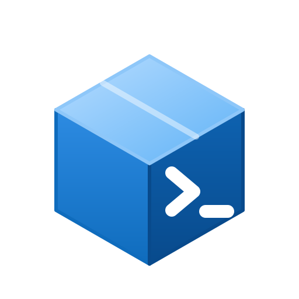
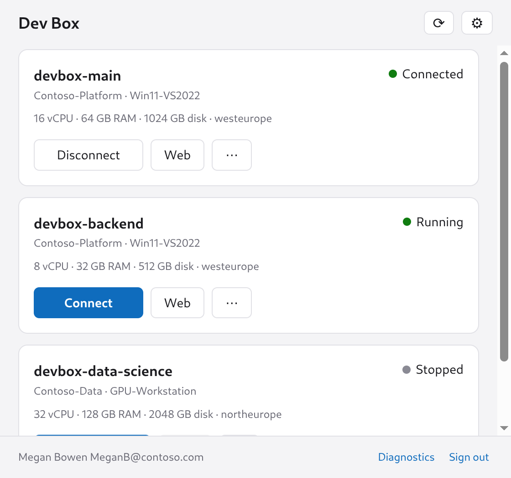
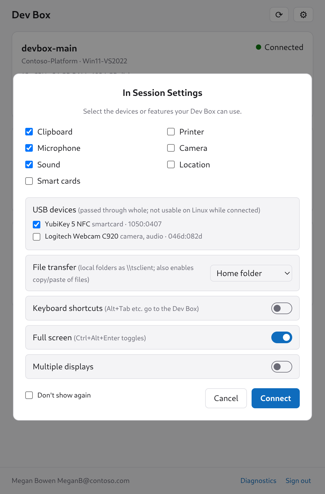

#  Dev Box client

Electron app that lists your Microsoft Dev Boxes, starts/stops them, and connects
using Entra ID, with no tenant admin rights or app registration needed. On Linux it
connects with FreeRDP 3; on Windows it hands the session to the Remote Desktop
client (`msrdc.exe`) or the Windows App (`ms-avd:` URI).

<p align="center">
  <picture>
    <source media="(prefers-color-scheme: dark)" srcset="docs/main-dark.png">
    
  </picture>
  <picture>
    <source media="(prefers-color-scheme: dark)" srcset="docs/session-dark.png">
    
  </picture>
</p>

```
sudo apt install freerdp3-sdl     # Linux: native Wayland client; freerdp3-x11 also works on X11
npm install
npm start            # run
npm run dist:linux   # build a .deb into dist/
npm run dist:win     # build a Windows NSIS installer into dist/ (run on Windows)
```

## How it works

| Step | What | Auth (borrowed first-party public client) |
|---|---|---|
| 1. Sign in | Embedded Entra login window (MFA/CA works) | Azure CLI `04b07795-…` |
| 2. Discover Dev Centers | Azure Resource Graph: projects → `properties.devCenterUri` | Azure CLI → `management.azure.com` |
| 3. List / start / stop | Dev Center data plane `GET /users/me/devboxes` etc. | Azure CLI → `devcenter.azure.com` |
| 4. Connection info | `.../devboxes/{name}/remoteConnection` → `ms-avd:connect?workspaceId=…&resourceid=…` | Azure CLI |
| 5. .rdp file | `rdweb.wvd.microsoft.com/api/arm/feeddiscovery/tenants/{workspaceId}/rdps/{resourceId}.rdp` (as the Windows 365 web client does), feed search as fallback | Remote Desktop `a85cf173-4192-…` (same as FreeRDP) → `www.wvd.microsoft.com` |
| 6. Connect (Linux) | `xfreerdp3 <file>.rdp`; FreeRDP's ARM gateway + RDS AAD auth prompts ("Browse to: …") are answered by our sign-in window and fed to its stdin | Remote Desktop `a85cf173-…` (FreeRDP's own) |
| 6. Connect (Windows) | `msrdc.exe <file>.rdp` (session options from step 5 still apply), or Windows App via the `ms-avd:` URI from step 4 when msrdc is not installed | the client's own Entra auth |

All sign-in windows share one cookie jar, so after the first login the other
flows normally complete invisibly via SSO. Tokens are cached in
`~/.config/Dev Box/` and encrypted with the OS keyring (Electron `safeStorage`).

## When something fails

Open **Diagnostics** (footer): every HTTP call, the feed contents and FreeRDP output are logged.

- **"No Dev Center projects visible via Resource Graph"**: you may lack ARM
  read access. Open devportal.microsoft.com, find requests to
  `*.devcenter.azure.com` in browser devtools, and paste that origin into
  Settings → Dev Center endpoints.
- **Conditional Access blocks a client ID**: try another first-party client in
  Settings → Advanced (e.g. Azure PowerShell `1950a258-227b-4e31-a9cf-717495945fc2`
  for Azure, redirect `http://localhost`).
- **Dev Box not found in the AVD feed**: check the logged feed body; adjust feed
  URLs in Settings → Advanced. The **Web** button opens the Windows 365 web client inside the app (sharing the sign-in) as a fallback; ⋯ → *Open in system browser* uses your normal browser.
- **FreeRDP fails after auth**: FreeRDP output is in Diagnostics. Extra flags go in
  Settings (e.g. `/f`, `/multimon`, `/log-level:DEBUG`, `/sec:aad`).
